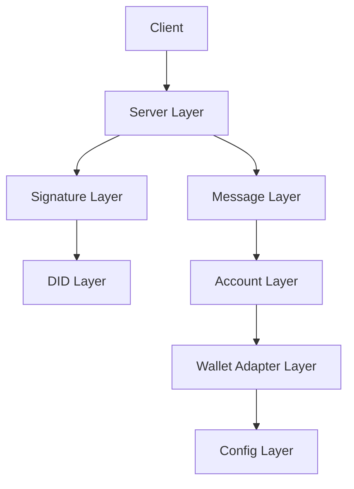

# Architecture Overview

The KeyPass Login SDK follows a 7-layer architecture designed for modularity, security, and maintainability. Each layer has a specific responsibility and interacts with other layers through well-defined interfaces.

## Layer System

### 1. Config Layer (`src/config/`)
- **Purpose**: Configuration management and validation
- **Components**:
  - Wallet adapter configurations
  - Message format templates
  - Validation rules
- **Key Files**:
  - `config/validator.ts`: Configuration validation
  - `config/messageFormat.json`: Message templates

### 2. Wallet Adapter Layer (`src/adapters/`)
- **Purpose**: Wallet interaction abstraction
- **Components**:
  - `WalletAdapter` interface
  - Polkadot.js implementation
  - Talisman implementation
- **Key Features**:
  - Wallet connection management
  - Account listing
  - Message signing
  - Error handling

### 3. Account Layer (`src/accounts/`)
- **Purpose**: Account management and selection
- **Components**:
  - Account selection logic
  - Address validation
  - Account metadata
- **Key Features**:
  - Single/multi-account handling
  - Address format verification
  - Account filtering

### 4. Message Layer (`src/message/`)
- **Purpose**: Message handling and validation
- **Components**:
  - Message builder
  - Template management
  - Validation rules
- **Key Features**:
  - Message construction
  - Timestamp handling
  - Nonce generation
  - Format validation

### 5. Signature Layer (`src/server/verificationService.ts`)
- **Purpose**: Cryptographic operations
- **Components**:
  - Signature verification
  - Message validation
  - Tampering detection
- **Key Features**:
  - sr25519 support
  - ed25519 support
  - Message integrity checks

### 6. DID Layer (`src/did/`)
- **Purpose**: Decentralized identifier management
- **Components**:
  - DID creation
  - DID document generation
  - Address resolution
- **Key Features**:
  - did:key method implementation
  - DID document creation
  - Address to DID conversion

### 7. Server Layer (`src/server/`)
- **Purpose**: API and middleware
- **Components**:
  - Express middleware
  - Request validation
  - Error handling
- **Key Features**:
  - REST API endpoints
  - Security headers
  - Rate limiting
  - Request validation

## Data Flow

1. **Authentication Initiation**
   ```
   Client -> Config Layer -> Wallet Adapter Layer
   ```

2. **Wallet Connection**
   ```
   Wallet Adapter Layer -> Account Layer -> Message Layer
   ```

3. **Message Signing**
   ```
   Message Layer -> Wallet Adapter Layer -> Signature Layer
   ```

4. **Verification**
   ```
   Signature Layer -> DID Layer -> Server Layer -> Client
   ```

## Component Interactions



## Security Considerations

- Each layer implements its own security measures
- Cross-layer communication is strictly typed
- Error handling is consistent across layers
- Cryptographic operations are isolated
- Input validation at each layer

## Best Practices

1. **Layer Independence**
   - Each layer should be independently testable
   - Dependencies flow downward
   - No circular dependencies

2. **Error Handling**
   - Errors are caught at the appropriate layer
   - Error types are specific to each layer
   - Error messages are user-friendly

3. **Type Safety**
   - TypeScript interfaces for all layer boundaries
   - Runtime type checking where necessary
   - Comprehensive type definitions

4. **Testing**
   - Unit tests for each layer
   - Integration tests for layer interactions
   - End-to-end tests for complete flows 