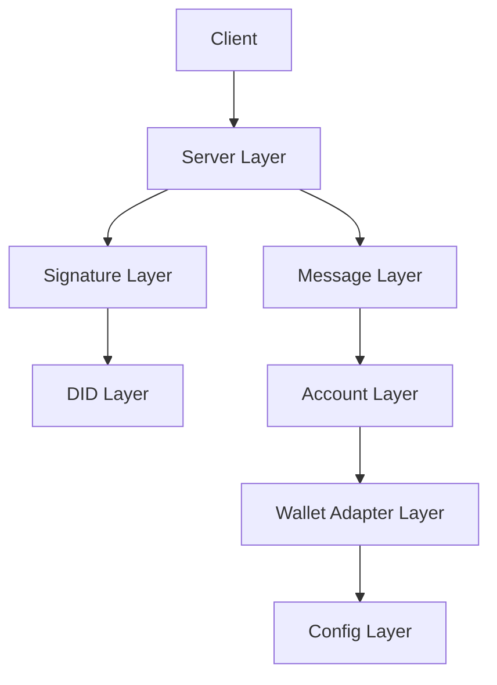

# Architecture Overview

The KeyPass Login SDK follows a 7-layer architecture designed for modularity, security, and maintainability. Each layer has a specific responsibility and interacts with other layers through well-defined interfaces.

## Layer System

### 1. Config Layer (`src/config/`)
- **Purpose**: Configuration management and validation
- **Components**:
  - Wallet adapter configurations
  - Message format templates
  - Validation rules
- **Key Files**:
  - `config/validator.ts`: Configuration validation
  - `config/messageFormat.json`: Message templates

### 2. Wallet Adapter Layer (`src/adapters/`)
- **Purpose**: Wallet interaction abstraction
- **Components**:
  - `WalletAdapter` interface
  - Polkadot.js implementation
  - Talisman implementation
  - WalletConnect implementation
- **Key Features**:
  - Wallet connection management
  - Account listing
  - Message signing
  - Error handling

### 3. Account Layer (`src/accounts/`)
- **Purpose**: Account management and selection
- **Components**:
  - Account selection logic
  - Address validation
  - Account metadata
- **Key Features**:
  - Single/multi-account handling
  - Address format verification
  - Account filtering

### 4. Message Layer (`src/message/`)
- **Purpose**: Message handling and validation
- **Components**:
  - Message builder
  - Template management
  - Validation rules
- **Key Features**:
  - Message construction
  - Timestamp handling
  - Nonce generation
  - Format validation

### 5. Signature Layer (`src/server/verificationService.ts`)
- **Purpose**: Cryptographic operations
- **Components**:
  - Signature verification
  - Message validation
  - Tampering detection
- **Key Features**:
  - sr25519 support
  - ed25519 support
  - Message integrity checks

### 6. DID Layer (`src/did/`)
- **Purpose**: Decentralized identifier management
- **Components**:
  - DID creation
  - DID document generation
  - Address resolution
- **Key Features**:
  - did:key method implementation
  - DID document creation
  - Address to DID conversion

### 7. Server Layer (`src/server/`)
- **Purpose**: API and middleware
- **Components**:
  - Express middleware
  - Request validation
  - Error handling
- **Key Features**:
  - REST API endpoints
  - Security headers
  - Rate limiting
  - Request validation

## Data Flow

1. **Authentication Initiation**
   ```
   Client -> Config Layer -> Wallet Adapter Layer
   ```

2. **Wallet Connection**
   ```
   Wallet Adapter Layer -> Account Layer -> Message Layer
   ```

3. **Message Signing**
   ```
   Message Layer -> Wallet Adapter Layer -> Signature Layer
   ```

4. **Verification**
   ```
   Signature Layer -> DID Layer -> Server Layer -> Client
   ```

## Component Interactions



## Security Considerations

- Each layer implements its own security measures
- Cross-layer communication is strictly typed
- Error handling is consistent across layers
- Cryptographic operations are isolated
- Input validation at each layer

## Best Practices

1. **Layer Independence**
   - Each layer should be independently testable
   - Dependencies flow downward
   - No circular dependencies

2. **Error Handling**
   - Errors are caught at the appropriate layer
   - Error types are specific to each layer
   - Error messages are user-friendly

3. **Type Safety**
   - TypeScript interfaces for all layer boundaries
   - Runtime type checking where necessary
   - Comprehensive type definitions

4. **Testing**
   - Unit tests for each layer
   - Integration tests for layer interactions
   - End-to-end tests for complete flows

## Core Components

### Wallet Connection Layer

```
┌─────────────────┐
│  connectWallet  │
└────────┬────────┘
         │
         ▼
┌─────────────────┐
│  WalletAdapter  │◄─────┐
└────────┬────────┘      │
         │               │
    ┌────┴─────┐    ┌────┴─────┐    ┌───────────────┐
    │PolkadotJs│    │ Talisman │    │WalletConnect  │
    │ Adapter  │    │ Adapter  │    │   Adapter     │
    └──────────┘    └──────────┘    └───────────────┘
```

The wallet connection layer provides a unified interface for connecting to different wallet types:

1. **connectWallet**: Main entry point that attempts to connect to available wallets in priority order
2. **WalletAdapter**: Common interface implemented by all wallet adapters
3. **Specific Adapters**: Implementations for different wallet types:
   - PolkadotJsAdapter: For the Polkadot.js extension
   - TalismanAdapter: For the Talisman wallet
   - WalletConnectAdapter: For any wallet supporting WalletConnect

### Authentication Flow

```
┌─────────────┐     ┌─────────────┐     ┌─────────────┐
│  Connect    │     │   Sign      │     │  Verify     │
│  Wallet     │────►│  Message    │────►│ Signature   │
└─────────────┘     └─────────────┘     └─────────────┘
                          │                   │
                          ▼                   ▼
                    ┌─────────────┐     ┌─────────────┐
                    │  Create     │     │  Generate   │
                    │    DID      │     │  Session    │
                    └─────────────┘     └─────────────┘
```

The authentication flow is handled by the `loginWithPolkadot` function, which:
1. Connects to a wallet using the adapter pattern
2. Gets the user's accounts
3. Generates and signs a login message
4. Verifies the signature
5. Creates a DID for the address
6. Generates a session

### DID Management

```
┌─────────────────┐
│PolkadotDIDProvider│
└────────┬────────┘
         │
    ┌────┴─────┐
    │  Create  │
    │    DID   │
    └────┬─────┘
         │
    ┌────┴─────┐
    │  DID     │
    │Document  │
    └──────────┘
```

The DID management layer:
1. Creates DIDs for Polkadot addresses
2. Generates DID documents
3. Provides DID resolution
4. Manages verification methods

## Wallet Adapters

### Common Interface

All wallet adapters implement the `WalletAdapter` interface:

```typescript
interface WalletAdapter {
  enable(): Promise<void>;
  getAccounts(): Promise<WalletAccount[]>;
  signMessage(message: string): Promise<string>;
  getProvider(): string | null;
  disconnect(): Promise<void>;
  on(event: string, callback: EventHandler): void;
  off(event: string, callback: EventHandler): void;
}
```

### Adapter Types

1. **PolkadotJsAdapter**
   - Connects to the Polkadot.js browser extension
   - Uses `@polkadot/extension-dapp`
   - Priority: 1

2. **TalismanAdapter**
   - Connects to the Talisman wallet extension
   - Uses Talisman's injected provider
   - Priority: 2

3. **WalletConnectAdapter**
   - Connects to any wallet supporting WalletConnect
   - Uses `@walletconnect/web3-provider`
   - Requires WalletConnect project ID
   - Priority: 3

## Error Handling

The SDK uses a hierarchical error system:

```
Error
├── WalletError
│   ├── WalletNotFoundError
│   ├── UserRejectedError
│   ├── TimeoutError
│   └── WalletConnectionError
├── ValidationError
│   ├── MessageValidationError
│   └── AddressValidationError
└── AuthenticationError
    ├── InvalidSignatureError
    └── ConfigurationError
```

## Configuration

The SDK can be configured through:

1. Environment variables:
   ```
   WALLETCONNECT_PROJECT_ID=your_project_id_here
   ```

2. Wallet configuration (wallets.json):
   ```json
   {
     "wallets": [
       {
         "id": "polkadot-js",
         "name": "Polkadot.js",
         "adapter": "PolkadotJsAdapter",
         "priority": 1
       },
       {
         "id": "talisman",
         "name": "Talisman",
         "adapter": "TalismanAdapter",
         "priority": 2
       },
       {
         "id": "walletconnect",
         "name": "WalletConnect",
         "adapter": "WalletConnectAdapter",
         "priority": 3
       }
     ]
   }
   ```

## Security Considerations

1. **Message Signing**
   - Messages are validated and sanitized
   - Signatures are verified
   - Nonces prevent replay attacks

2. **Session Management**
   - Sessions expire after a configurable timeout
   - DIDs provide verifiable identity
   - Secure headers protect against common web vulnerabilities

3. **WalletConnect Security**
   - Project ID required for WalletConnect
   - Session encryption
   - Chain ID validation
   - Address validation 